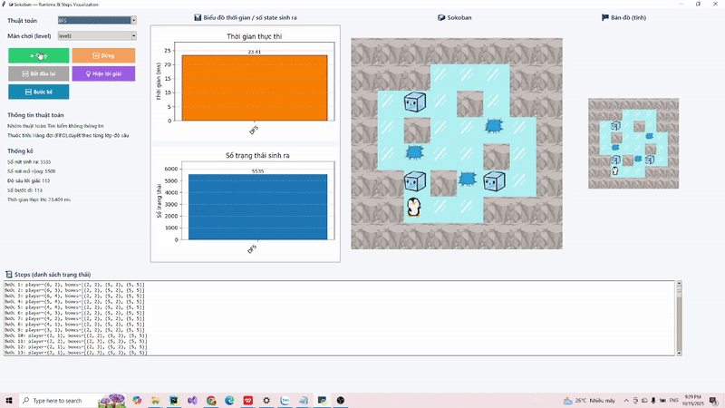
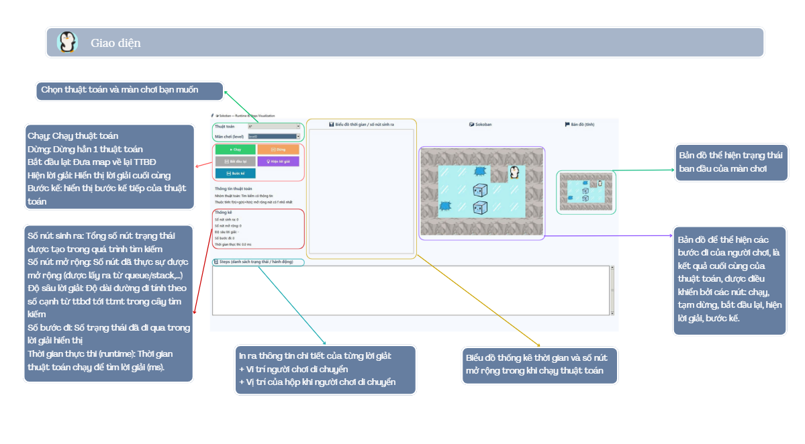

# 🧩 Sokoban AI Solver — AI Project

 

*(GIF demo minh họa thuật toán BFS tìm đường đẩy hộp Sokoban)*

---

## Giới thiệu

**Sokoban** là bài toán kinh điển trong Trí tuệ Nhân tạo (AI) dùng để minh họa các kỹ thuật **tìm kiếm trạng thái** (State Space Search).  
Người chơi di chuyển trong mê cung lưới ô vuông, **đẩy** (không kéo) các hộp vào vị trí **mục tiêu**.  
Mỗi bước di chuyển có thể là **đi bộ** hoặc **đẩy hộp** theo bốn hướng: **Lên / Xuống / Trái / Phải**.

Mục tiêu của dự án:
> Xây dựng một hệ thống AI có thể **tự động giải bài toán Sokoban** bằng nhiều thuật toán tìm kiếm khác nhau, đo lường **thời gian**, **bộ nhớ**, và **số bước** đạt đích.
---

---
## Cấu trúc thư mục / Project Structure

```
Sokoban/
├── app.py                     # Giao diện Tkinter + Matplotlib
├── README.md                  # Tài liệu mô tả dự án
│
├── algorithms/                # Các thuật toán tìm kiếm
│   ├── bfs.py                 # Breadth-First Search
│   ├── dfs.py                 # Depth-First Search
│   ├── greedy.py              # Greedy Best-First Search
│   ├── astar.py               # A* Search
│   ├── beam.py                # Beam Search
│   ├── simulated_annealing.py # Simulated Annealing
│   ├── and_or.py              # AND–OR Search
│   ├── partial_observable.py  # BFS với môi trường mờ
│   ├── backtracking.py        # CSP Backtracking
│   ├── forward_checking.py    # CSP + Forward Checking
│   └── __init__.py
│
├── sokoban/
│   └── level.py               # Định nghĩa State, Level, neighbors, heuristic
│
├── levels/
│   ├── level0.txt
│   ├── level1.txt
│   ├── level2.txt
│   ├── level3.txt
│   └── level4.txt
│
├── utils/
│   └── timer.py               # Đo thời gian (ms)
│
└── Assets/
    ├── player.png, box.png, wall.png, point.png, space.png
    ├── arrow_left.png, arrow_right.png
    └── demo.gif               # GIF demo 
```

---

## Cài đặt

```bash
pip install "matplotlib>=3.7,<3.10" "numpy>=1.23" "Pillow>=9.0"
```

**Yêu cầu:**  
- Python ≥ 3.10  
- Các thư viện chuẩn: `tkinter`, `matplotlib`, `heapq`, `itertools`, `collections`, `dataclasses`

---

## Cách chạy 

```bash
python app.py
```

1️⃣ Chọn **Level** trong combobox  
2️⃣ Chọn **Thuật toán** (BFS, DFS, Greedy, A*, …)  
3️⃣ Nhấn **Chạy** để bắt đầu  
4️⃣ Quan sát **bảng thống kê thời gian, số nút sinh ra, số bước đi**

---

## Các thuật toán đã triển khai

| Thuật toán                            | Đặc điểm chính |
|---------------------------------------|----------------|
| **BFS**, **DFS**                      | Tìm kiếm theo lớp hoặc theo chiều sâu, không dùng heuristic |
| **Greedy**, **A***                    | Dùng hàm heuristic để ước lượng khoảng cách đến đích |
| **Simulated Annealing**,              | Tìm kiếm ngẫu nhiên có điều khiển bằng nhiệt độ |
| **Beam Search**                       | Giữ K trạng thái tốt nhất ở mỗi lớp, tiết kiệm bộ nhớ |
| **Partial Observable**                   | Tác nhân chỉ quan sát trong bán kính giới hạn, mở rộng dần |
| **Backtracking**, **Forward Checking** | Giải như bài toán ràng buộc biến, phát hiện dead-end sớm |
| **AND–OR Search**                     | Mô phỏng kế hoạch điều kiện trong môi trường không chắc chắn |

---

## 📊 Đánh giá & Kết quả thực nghiệm 
| Thuật toán                   | Nhận xét chính                                                |
| :--------------------------- | :------------------------------------------------------------ |
| **PO (Partial Observable)**  | Nhanh và tiết kiệm bộ nhớ; thích hợp môi trường mờ.           |
| **DFS**                      | Rất nhanh ở map nhỏ nhưng dễ lạc hướng, tốn RAM ở map lớn.    |
| **Greedy**                   | Tốc độ cao, nhưng dễ kẹt ở deadlock.                          |
| **A***                       | Cân bằng giữa tốc độ và tối ưu; hiệu quả nhất tổng thể.       |
| **BFS**                      | Ổn định, tìm lời giải ngắn nhất, nhưng mở rộng nhiều.         |
| **Beam**                     | Kiểm soát tài nguyên tốt, nhưng phụ thuộc Beam width.         |
| **SA (Simulated Annealing)** | Chậm nhất; khám phá ngẫu nhiên, nhiều pha làm nguội.          |
| **And–Or Search**            | Sinh cực nhiều nút do cấu trúc cây điều kiện phức tạp.        |
| **Backtracking (CSP)**       | Nhiều nhánh vô ích, kém hiệu quả so với Forward.              |
| **Forward Checking (CSP)**   | Tối ưu nhất trong nhóm CSP; cắt tỉa sớm giảm mạnh trạng thái. |

---
**Tổng kết:**  
- Greedy và A* là hai thuật toán **tối ưu nhất** giữa tốc độ và bộ nhớ.  
- Backtracking và Forward Checking giúp **giảm đáng kể không gian trạng thái**.  
- SA và And-Or Search chủ yếu dùng cho **nghiên cứu mô phỏng** không phù hợp cho bài toán Sokoban.

---

## 🚀 Hướng cải tiến

- **Deadlock Detection:** phát hiện sớm “ô chết” để cắt bỏ trạng thái vô ích.  
- **Heuristic nâng cao:** dùng *minimum matching* giữa hộp–mục tiêu.  
- **Weighted A\*:** ưu tiên các nhánh “hứa hẹn” để giảm độ sâu.  
- **Bidirectional Search:** tìm kiếm hai chiều, giảm độ phức tạp trung bình từ *O(b^d)* xuống *O(b^(d/2))*.

---

## 👨‍💻 Nhóm sinh viên thực hiện

| Thành viên          | MSSV                  |
|---------------------|-----------------------|
| Huỳnh Gia Diễm Ngọc | 23110132              |
| Võ Thị Mai Quỳnh    | 23110147              |

---

**Trường Đại học Sư phạm Kỹ thuật TP.HCM – HCMUTE**  
**Khoa Công nghệ thông tin – Đồ án môn học Trí tuệ Nhân tạo**

---

